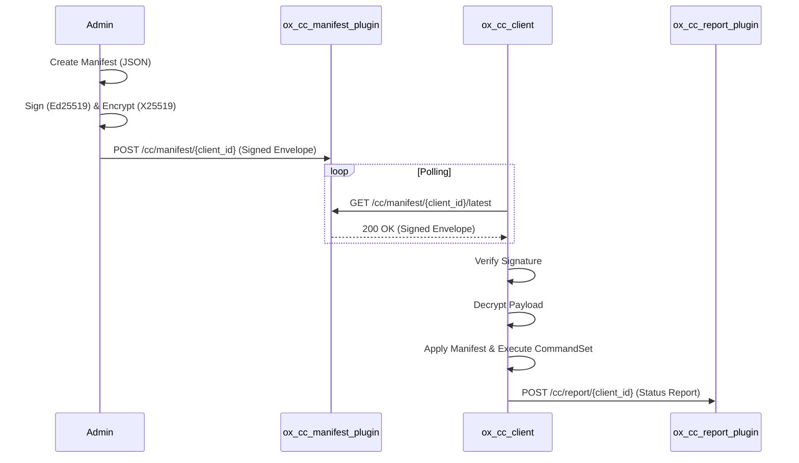

# ox_cc Architecture

This document describes the technical architecture and security model of the ox_cc system.

## System Overview

ox_cc follows a "Pull" model where clients periodically poll a central server for updates. This design is robust against temporary network outages and simplifies firewall configurations on managed nodes.

## Security Model

### Cryptography

The system uses modern cryptographic primitives:
- **Signing**: Ed25519 for manifest integrity and authenticity.
- **Encryption**: X25519 (Diffie-Hellman) for manifest confidentiality, combined with a symmetric cipher (typically in an AEAD mode) via `ox_cc_common`.

### The Signed Envelope

Communication is wrapped in a `WireEnvelope`. This structure contains:
1. **Manifest ID**: A unique identifier for the specific version of the manifest.
2. **Timestamp**: Prevents replay attacks (manifests have a validity window).
3. **Signatures**: One or more Ed25519 signatures.
4. **Encrypted Payload**: The actual manifest JSON, encrypted for the target client.

### Client Isolation

Each client has its own X25519 keypair. Manifests are encrypted specifically for a target `client_id`'s public key. This ensures that even if a client's communication is intercepted, or if another client is compromised, they cannot read manifests intended for others.

## Component Details

### ox_cc_client

The client runs as a background daemon. Its lifecycle is:
1. **Load Config**: Read `client.yaml`, load private encryption key, and broker public verification keys.
2. **Initialize DB**: Open a local SQLite database for tracking applied manifests and pending reports.
3. **Poll Loop**: 
    - Retry any failed status reports.
    - Fetch the latest envelope from the server.
    - If the `manifest_id` is new:
        - Verify signatures against trusted broker keys.
        - Decrypt the payload.
        - Atomically write the manifest to the configured consumer directory.
        - Execute any `commandset` entries.
        - Send a report back to the server.

### ox_cc_executor

The executor processes a list of `CommandEntry` objects.
- **Built-in Commands**:
    - `download`: Fetches a file from a URL.
    - `install`: Runs a package manager or installation script.
    - `os_info`: Collects system metadata.
    - `log_info`: Emits log messages.
- **Plugins**: Any executable in the `plugin_dir` can be invoked as a command.
- **State Chaining**: Commands can output JSON which is merged into a "state map" and can be used as input for subsequent commands.

### Server Plugins

The server components are implemented as `ox_workflow` plugins:
- **Manifest Plugin**: Provides an authenticated (via client ID) endpoint for clients to get their latest manifest, and an administrative endpoint for deploying new ones.
- **Report Plugin**: Receives reports from clients. It includes rate-limiting to prevent log-spamming from compromised or malfunctioning clients.
